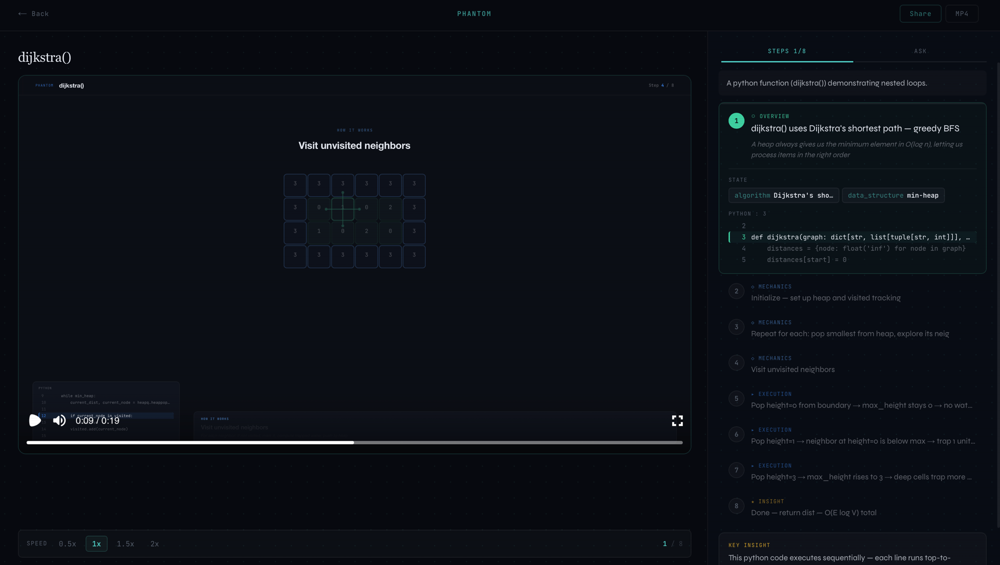
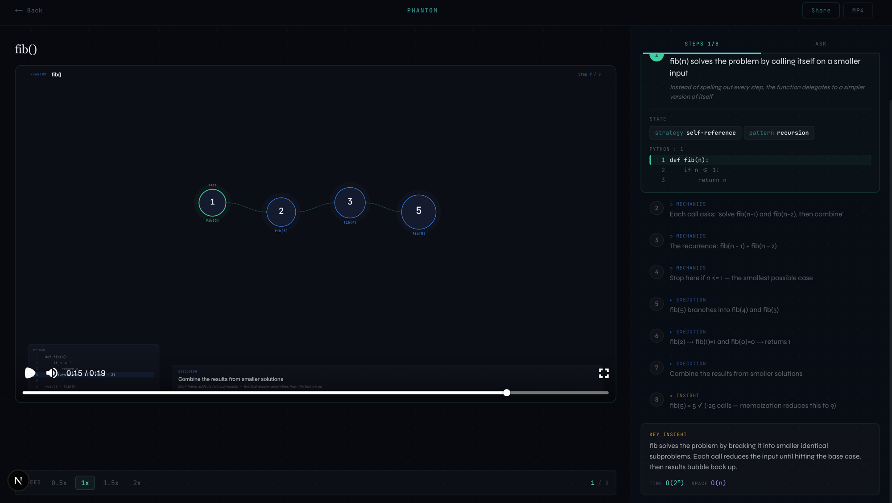

<h1 align="center">Phantom</h1>

<p align="center">
  <strong>AI-generated animated explanations of code.</strong><br>
  Paste any function. Get a cinematic animation of what it actually does when it runs.
</p>

<p align="center">
  <a href="#getting-started">Get Started</a> &nbsp;&bull;&nbsp;
  <a href="#how-it-works">How It Works</a> &nbsp;&bull;&nbsp;
  <a href="#the-viewer">Viewer</a> &nbsp;&bull;&nbsp;
  <a href="#deployment">Deploy</a> &nbsp;&bull;&nbsp;
  <a href="#contributing">Contribute</a>
</p>

---

## Demo

Recursion tree animation generated from a 10-line fibonacci function:

<p align="center">
  
</p>

---

## What is this?

Phantom takes source code and produces narrated, step-by-step animated explanations — recursion trees unfolding, control flow branching, variables mutating, data structures building. Built for engineers who learn visually.

The LLM never generates animation code from scratch. Instead, Phantom ships **hand-crafted Remotion templates** and the AI's job is to pick a template and fill in its parameters. A constrained, structured task it does reliably.

If no template matches, it falls back to a generic step-through animation. Never a blank screen.

---

## The viewer

The viewer page is where the learning happens. Two-panel layout: animation on the left, interactive explanation on the right.

### Dijkstra's shortest path algorithm



The animation shows a grid-based shortest path visualization. The right panel breaks it down — current step highlighted, variable state displayed, code line tracked, complexity analysis shown.

### Fibonacci recursion



Recursive calls visualized as growing circles. The explanation panel shows strategy badges (`self-reference`, `recursion`), code context, and builds up to the key insight: how memoization reduces 25 calls to 9.

### Viewer features

- **Click any step** to jump the animation to that point
- **Speed controls** — 0.5x / 1x / 1.5x / 2x playback
- **Variable state** — see values change at each execution step
- **Code tracking** — active line highlighted in context
- **Ask tab** — chat with AI about the code for follow-up questions
- **Share & download** — shareable link or MP4 export

---

## How it works

```
  Your code
    │
    ▼
┌─────────────────────────────────────────────────────────┐
│  1. Parser         tree-sitter AST + metadata           │
│  2. Analyzer       Claude Opus reasons about the code   │
│  3. Planner        picks template + fills parameters    │
│  4. Composer       generates validated Remotion props   │
│  5. Narrator       Claude Haiku writes timed captions   │
│  6. Renderer       Remotion produces MP4 + poster       │
└─────────────────────────────────────────────────────────┘
    │
    ▼
  Animated explanation with step-by-step narration
```

### The pipeline in detail

**Parser** — [tree-sitter](https://tree-sitter.github.io/) extracts the AST, function signatures, control flow, and recursive patterns. Supports Python, TypeScript, JavaScript, C#, and Rust.

**Analyzer** — Claude Opus 4.6 reasons about what the code *conceptually does* and produces a structured `VisualizationIntent`:

```json
{
  "code_type": "recursive_function",
  "entry_point": "fibonacci",
  "sample_input": 5,
  "notable_patterns": ["binary_recursion", "overlapping_subproblems"],
  "time_complexity": "O(2^n)",
  "space_complexity": "O(n)",
  "key_insight": "Each call branches into two subcalls, creating exponential work"
}
```

**Planner** — Selects the best animation template from the registry and fills in structured parameters. Falls back to `ControlFlowBranch` if nothing specialized matches.

**Composer** — Validates output against the template's Zod schema (shared across Python and TypeScript). Catches AI hallucinations before they hit the renderer.

**Narrator** — Claude Haiku 4.5 generates timed captions synced to animation beats. Each caption has a phase (overview, mechanics, execution, insight) and descriptive text.

**Renderer** — Node.js worker runs `@remotion/renderer` to produce MP4 + poster PNG. Uploads to cloud storage. The web app polls for completion.

---

## Animation templates

Hand-crafted Remotion compositions with typed props. The AI pipeline selects and parameterizes them.

| Template | Visualizes | Code types |
|---|---|---|
| **RecursionTree** | Binary tree unfolding with duplicate-call highlighting | Recursive functions (fibonacci, factorial) |
| **ControlFlowBranch** | Step-by-step execution with concept shapes and variable state | Everything else — generic fallback |

### Concept shapes

The ControlFlowBranch template renders specialized SVG visualizations based on what the code does:

| Shape | Triggers on | What it shows |
|---|---|---|
| Recursive function | `recursive_function` | Nested call frames stacking |
| Sorting | `sorting`, `comparison` | Bars swapping and comparing |
| Async | `async`, `concurrent` | Parallel timeline lanes |
| Tree traversal | `tree_traversal` | Binary tree with progressive node visits |
| Hash map | `hash_map`, `dictionary` | Bucket slots with collision chaining |
| Class definition | `class_definition`, `class` | UML-style box with fields and methods |
| Heap / graph | `heap`, `graph` | Connected nodes with weighted edges |
| Dynamic programming | `dynamic_programming` | Grid/table filling progressively |
| React components | `react`, `component` | Component tree hierarchy |

### Reusable primitives

| Primitive | Purpose |
|---|---|
| `AnimatedTree` | Tree structures with spring animations and edge drawing |
| `AnimatedArray` | Array visualization with highlighting and swaps |
| `Caption` | Timed narration with optional subtext |
| `CodeHighlight` | Syntax-highlighted code with active line indicator |
| `VariablePanel` | Key-value variable state display |

---

## Tech stack

| Layer | Technology |
|---|---|
| Monorepo | Turborepo + pnpm workspaces |
| Web app | Next.js 15, React 19, Tailwind CSS v4, TypeScript |
| Animations | Remotion 4, React, SVG |
| AI pipeline | Python 3.12, Anthropic SDK, Pydantic v2 |
| Models | Claude Opus 4.6 (analysis) + Claude Haiku 4.5 (narration) |
| Rendering | `@remotion/renderer`, BullMQ |
| Playback | `@remotion/player` (browser-side) |

---

## Project structure

```
phantom/
├── apps/
│   ├── web/                     # Next.js web app
│   │   ├── app/
│   │   │   ├── page.tsx         # Landing page with code editor
│   │   │   ├── v/[id]/         # Shareable animation viewer
│   │   │   └── api/            # Generate + status endpoints
│   │   └── components/
│   └── renderer/               # Node.js rendering worker
│
├── packages/
│   ├── animations/             # Remotion templates + primitives
│   │   └── src/
│   │       ├── templates/      # RecursionTree, ControlFlowBranch
│   │       └── primitives/     # AnimatedTree, Caption, etc.
│   ├── engine/                 # Python AI pipeline
│   │   └── src/phantom_engine/
│   └── shared/                 # Shared TypeScript types
│
├── docs/assets/               # Screenshots and demo video
├── turbo.json
├── pnpm-workspace.yaml
└── package.json
```

---

## Getting started

### Prerequisites

- **Node.js** 20+
- **pnpm** 9+
- **Python** 3.12+
- **uv** — `curl -LsSf https://astral.sh/uv/install.sh | sh`
- **An API key** from any supported provider (see Configure below)

### Install

```bash
git clone https://github.com/hamzamiladin/Phantom.git
cd Phantom
pnpm install
cd packages/engine && uv sync && cd ../..
```

### Configure

#### Engine (`packages/engine/.env`)

Copy the example and fill in your provider's key:

```env
# Pipeline mode — set to true to skip AI calls and use local heuristics (no API key needed)
DEMO_MODE=false

# Pick one provider and fill in its key
# Free options:
#   groq       — Llama 3.3 70B, 14,400 req/day free  → console.groq.com
#   cerebras   — Llama 3.3 70B, 1M tokens/day free   → cloud.cerebras.ai
#   openrouter — DeepSeek R1 free, Qwen3 480B free   → openrouter.ai/keys
#   deepseek   — 5M tokens free (30 days)            → platform.deepseek.com
#   mistral    — 1B tokens/month free                 → console.mistral.ai
# Paid options:
#   claude     — Claude Opus/Haiku                    → console.anthropic.com
#   openai     — GPT-4o-mini                          → platform.openai.com
#   gemini     — Gemini 2.0 Flash                     → aistudio.google.com
AI_PROVIDER=groq

# API keys — fill in the one matching your provider
GROQ_API_KEY=
GROQ_MODEL=llama-3.3-70b-versatile

CEREBRAS_API_KEY=
CEREBRAS_MODEL=llama-3.3-70b

OPENROUTER_API_KEY=
OPENROUTER_MODEL=deepseek/deepseek-r1:free

DEEPSEEK_API_KEY=
DEEPSEEK_MODEL=deepseek-chat

MISTRAL_API_KEY=
MISTRAL_MODEL=mistral-large-latest

ANTHROPIC_API_KEY=
OPENAI_API_KEY=
GEMINI_API_KEY=
```

> **Quickest free setup:** Sign up at [console.groq.com](https://console.groq.com), grab a key, set `AI_PROVIDER=groq` and `GROQ_API_KEY=your-key`. Done.

#### Web app (`apps/web/.env.local`)

```env
ENGINE_URL=http://localhost:8000
RENDERER_URL=http://localhost:3001
```

### Run

```bash
# Terminal 1 — AI engine
cd packages/engine
uv run uvicorn phantom_engine.server:app --reload --port 8000

# Terminal 2 — Renderer
cd apps/renderer
pnpm dev

# Terminal 3 — Web app
cd apps/web
pnpm dev
```

Open [localhost:3000](http://localhost:3000), paste a function, click Generate.

---

## Deployment

| Service | Deploy to | Why |
|---|---|---|
| **Web app** (`apps/web`) | [Vercel](https://vercel.com) | Zero-config Next.js hosting |
| **Engine** (`packages/engine`) | [Railway](https://railway.app) | Stateless Python HTTP service |
| **Renderer** (`apps/renderer`) | [Railway](https://railway.app) + Redis add-on | Needs Chromium + job queue |

### Web app on Vercel

1. Import repo at [vercel.com/new](https://vercel.com/new)
2. Root directory: `apps/web`
3. Build command: `cd ../.. && npx turbo run build --filter=@phantom/web`
4. Add env vars: `ANTHROPIC_API_KEY`, `ENGINE_URL`, `RENDERER_URL`

### Engine on Railway

1. New service → connect GitHub repo → root: `packages/engine`
2. Start command: `uv run uvicorn phantom_engine.server:app --host 0.0.0.0 --port $PORT`
3. Add env var: `ANTHROPIC_API_KEY`

### Renderer on Railway

1. Add a Redis database from Railway dashboard
2. New service → root: `apps/renderer` → uses included `Dockerfile`
3. Add env vars: `REDIS_URL` (from Redis add-on), storage credentials
4. Needs **2GB+ RAM** for Remotion rendering

---

## Architecture decisions

**Why Remotion?** Active maintenance, Lambda parallel rendering, React-based API, large ecosystem. Motion Canvas is unmaintained as of 2026.

**Why templates instead of LLM-generated code?** LLMs can't reliably generate complex Remotion compositions. Templates are hand-crafted for quality — the LLM fills in parameters, which it does consistently.

**Why two Claude models?** Opus for analysis (deep reasoning). Haiku for narration (fast, cheap). Keeps cost to ~$0.05-0.15 per generation.

**Why frame-math sync?** Animation runs at 30fps, 72 frames per step. `Math.floor(currentFrame / 72)` gives frame-perfect panel sync without depending on narration timestamps.

---

## Contributing

1. Fork the repo
2. Create a feature branch: `git checkout -b feature/my-feature`
3. Make changes
4. Type check: `npx tsc --noEmit` in `apps/web` and `packages/animations`
5. Submit a pull request

### Adding a new template

1. Create component in `packages/animations/src/templates/`
2. Export component + default props
3. Add Zod schema to `packages/shared/src/types.ts`
4. Register in `packages/animations/src/Root.tsx`
5. Add player wrapper in `apps/web/components/AnimationPlayer.tsx`
6. Update engine planner to recognize the new code type

---

## License

MIT
